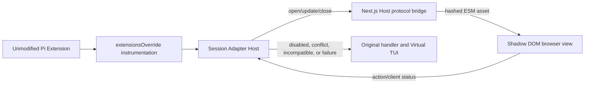

# WebUI Extension architecture

WebUI Adapters are progressive enhancement around unmodified Pi Extensions.
They are session-scoped, run third-party worker code only in the Pi worker, and
keep the original Virtual TUI path as the permanent fallback.



## Boundaries

- `DefaultResourceLoader.extensionsOverride` wraps Extension objects after
  loading. Wrappers retain the object and read its finalized `sourceInfo` at
  invocation time.
- `AsyncLocalStorage` attributes handlers, commands, shortcuts, tool execution,
  tool renderers, message renderers, and entry renderers to an Extension owner.
- The Next.js process reads and validates `package.json` manifests and client
  assets. It never imports an Adapter worker.
- The session worker verifies the target identity, SemVer range, declared
  capability, registration, runtime probe, and payload handling before using an
  Adapter.
- Browser clients load content-hashed same-origin ESM assets and mount only in
  a dedicated Shadow Root. They cannot add routes or access Host React context.

## Selection

For each Extension ID, the worker chooses in this order:

1. a compatible Adapter explicitly selected by the user;
2. the single compatible external or project Adapter;
3. the single compatible built-in Adapter;
4. the original Pi/TUI path.

Two compatible candidates at the same priority produce `conflict`; the Host
does not guess. Disabled, Prefer TUI, missing target, invalid SemVer, failed
probe, failed import, failed registration, invalid payload, activation timeout,
and client error all preserve the original path.

Project packages are discovered only after Pi reports the project trusted.
External and built-in packages do not inherit project trust.

## Runtime protocol

Protocol version 1 adds Zod-validated `WebUiViewSnapshot` state and these IPC
operations:

```text
Worker -> Host  webui.view.event, webui.extension.status
Host -> Worker  webui.view.list, webui.action.invoke, webui.client.status
```

The Host exposes only generic routes:

```text
GET  /api/v1/webui-extensions
GET  /api/v1/sessions/:sessionId/webui-views
POST /api/v1/sessions/:sessionId/webui-extensions/:extensionId/actions/:actionId
POST /api/v1/sessions/:sessionId/webui-extensions/:extensionId/client-status
GET  /api/v1/webui-extensions/:extensionId/assets/:digest/:file
```

View instances belong to one session and one selected Adapter. The worker owns
their state, revision, action dispatch, activation timeout, result Promise, and
disposal. The browser reports `ready`, `error`, or `disposed`; an error rejects
the blocking view so command instrumentation can invoke the original handler.

## Browser slots

The browser host supports:

```text
session.header       session.toolbar
conversation.before conversation.after
composer.above       composer.actions       composer.below
session.rightPanel   session.dialog          session.overlay
```

Dialog, overlay, and right-panel shells belong to the Host. Adapter markup and
styles stay inside Shadow DOM. Pi TUI surfaces retain their existing host and
can appear immediately after a native client failure.

## Distribution lifecycle

Built-ins and examples are ordinary workspace packages. `turbo build` builds
their worker/client bundles; release assembly copies built-ins to
`dist/webui-extensions/<package-directory>`. External packages are discovered
from their installed manifests at runtime, so installing or updating one does
not rebuild the Host. Asset hashes invalidate browser caches and worker imports
are isolated to the session process.
