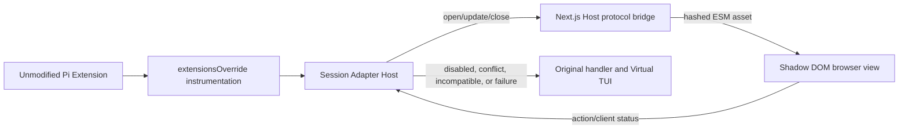

# WebUI Extension architecture

WebUI Adapters are progressive enhancement around unmodified Pi Extensions.
They are session-scoped, run third-party worker code only in the Pi worker, and
keep the original Virtual TUI path as the permanent fallback.


```mermaid
flowchart LR
  P["Unmodified Pi Extension"] --> I["extensionsOverride instrumentation"]
  I --> W["Session Adapter Host"]
  W -->|"open/update/close"| H["Next.js Host protocol bridge"]
  H -->|"hashed ESM asset"| B["Shadow DOM browser view"]
  B -->|"action/client status"| W
  W -->|"disabled, conflict, incompatible, or failure"| T["Original handler and Virtual TUI"]
```

## Boundaries

- `DefaultResourceLoader.extensionsOverride` wraps Extension objects after
  loading. Wrappers retain the object and read its finalized `sourceInfo` at
  invocation time.
- `AsyncLocalStorage` attributes handlers, commands, shortcuts, tool execution,
  tool renderers, message renderers, and entry renderers to an Extension owner.
  It also retains the Pi `ExtensionContext` that opened a view so later browser
  actions can invoke the matched target Extension without changing ownership.
- The Next.js process reads and validates `package.json` manifests and client
  assets. It never imports an Adapter worker.
- The session worker verifies the target identity, SemVer range, declared
  capability, registration, runtime probe, and payload handling before using an
  Adapter.
- A declared tool execution Adapter runs before the matched target tool. It may
  return a complete Pi tool result, or decline with optionally rewritten params
  so instrumentation invokes the original tool. An exception or invalid result
  exposes that fallback only before the handler calls a context side-effect API.
  After a view-side-effect API, target event, or direct target-tool call, failure
  returns a handled `isError` result so the original tool cannot repeat effects.
- Worker actions can invoke only tools registered by their matched target
  Extension, using the `ExtensionContext` captured when the view opened. Direct
  target invocation bypasses the same execution Adapter to prevent recursion.
  It does not add a synthetic tool call/result to session history; read-only
  queries and targets with their own persistence are valid, while extensions
  that replay state from tool-result messages must mutate through normal agent
  execution.
  Worker Adapters may also emit an existing target event contract through the
  session event bus; event names do not require a manifest contribution.
- Browser clients load content-hashed same-origin ESM assets and mount only in
  a dedicated Shadow Root. They cannot add routes or access Host React context.

## Selection

For each Extension ID, the worker chooses in this order:

1. a compatible Adapter explicitly selected by the user;
2. the single compatible external or project Adapter;
3. the single compatible built-in Adapter;
4. the original Pi/TUI path.

Two compatible candidates at the same priority produce `conflict`; the Host
does not guess. Disabled, Prefer TUI, missing target, invalid SemVer, failed
probe, failed import, failed registration, invalid payload, blocking-view
activation timeout, and client error all preserve the original path.

Project packages are discovered only after Pi reports the project trusted.
External and built-in packages do not inherit project trust.

## Runtime protocol

Protocol version 1 adds Zod-validated `WebUiViewSnapshot` state and these IPC
operations:

```text
Worker -> Host  webui.view.event, webui.extension.status
Host -> Worker  webui.view.list, webui.action.invoke, webui.client.status
```

The Host exposes only generic routes:

```text
GET  /api/v1/webui-extensions
GET  /api/v1/sessions/:sessionId/webui-views
POST /api/v1/sessions/:sessionId/webui-extensions/:extensionId/actions/:actionId
POST /api/v1/sessions/:sessionId/webui-extensions/:extensionId/client-status
GET  /api/v1/webui-extensions/:extensionId/assets/:digest/:file
```

View instances belong to one session and one selected Adapter. The worker owns
their state, revision, action dispatch, activation timeout, result Promise, and
disposal. The browser reports `ready`, `error`, or `disposed`; an error rejects
the blocking view so command instrumentation can invoke the original handler.
Non-blocking views may declare a stable `upsertKey`; opening the same key again
for the same Adapter updates that instance in place. Its `viewId` and placement
must remain stable. Blocking views cannot use `upsertKey`.

## RPC custom-message rendering

Pi does not call TUI message renderers in RPC mode. The session worker therefore
dispatches each completed, visible custom message directly to the selected
message-renderer Adapter. When a session binds, it also replays visible
`custom_message` entries from the active branch so resumed history receives the
same native cards as live messages.

When a renderer actually returns a view, its snapshot records the exact session
entry it replaces. The transcript hides only that generic custom-message
fallback while the native view exists; an incompatible payload or failed view
therefore remains visible without any Extension-specific type list.

Renderer cards are non-blocking state owned by the worker. They may open before
the task page mounts and remain available through `webui.view.list`, so they do
not use the client activation timeout, and a page unmount does not dispose their
worker state. Blocking dialogs still require a client to report `ready` before
that timeout and retain the original TUI fallback.

## Browser slots

The browser host supports:

```text
session.header       session.toolbar
conversation.before conversation.after
composer.above       composer.actions       composer.below
session.rightPanel   session.dialog          session.overlay
```

Dialog, overlay, and right-panel shells belong to the Host. Adapter markup and
styles stay inside Shadow DOM. Pi TUI surfaces retain their existing host and
can appear immediately after a native client failure.

## Distribution lifecycle

Built-ins and examples are ordinary workspace packages. `turbo build` builds
their worker/client bundles; release assembly copies built-ins to
`dist/webui-extensions/<package-directory>`. External packages are discovered
from their installed manifests at runtime, so installing or updating one does
not rebuild the Host. Asset hashes invalidate browser caches and worker imports
are isolated to the session process.
